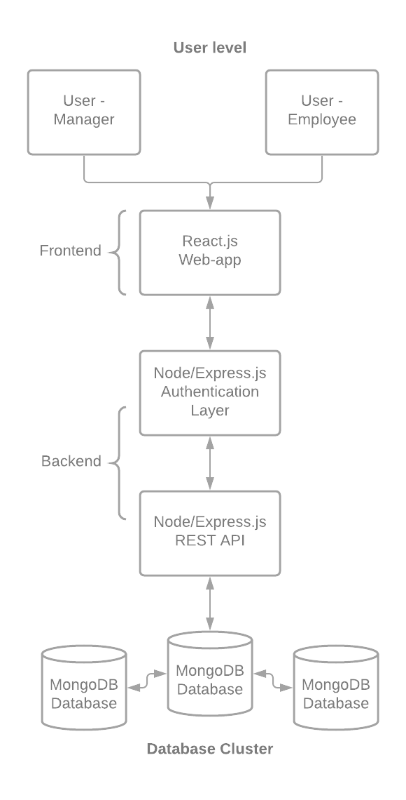
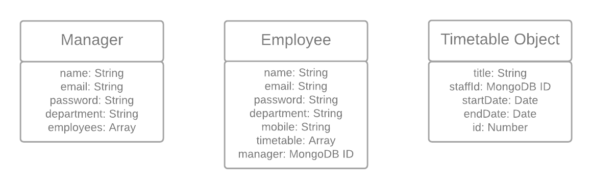
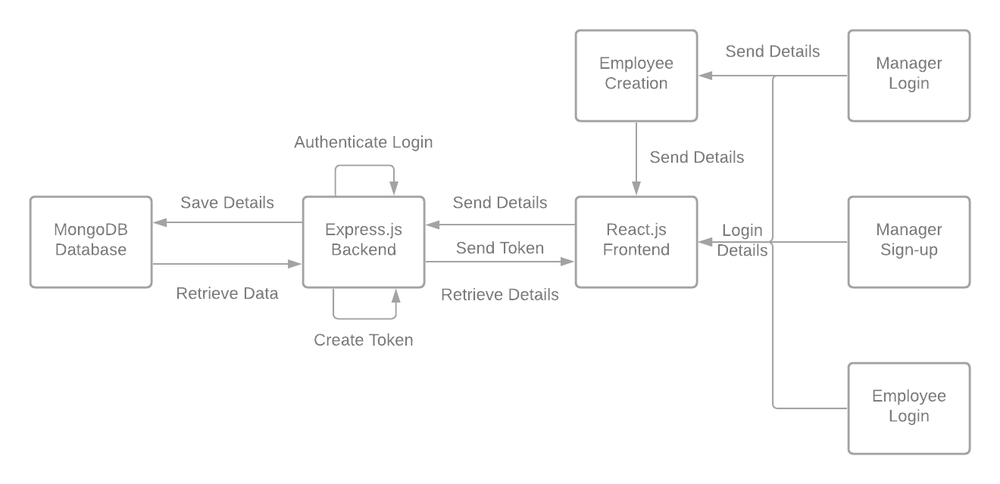
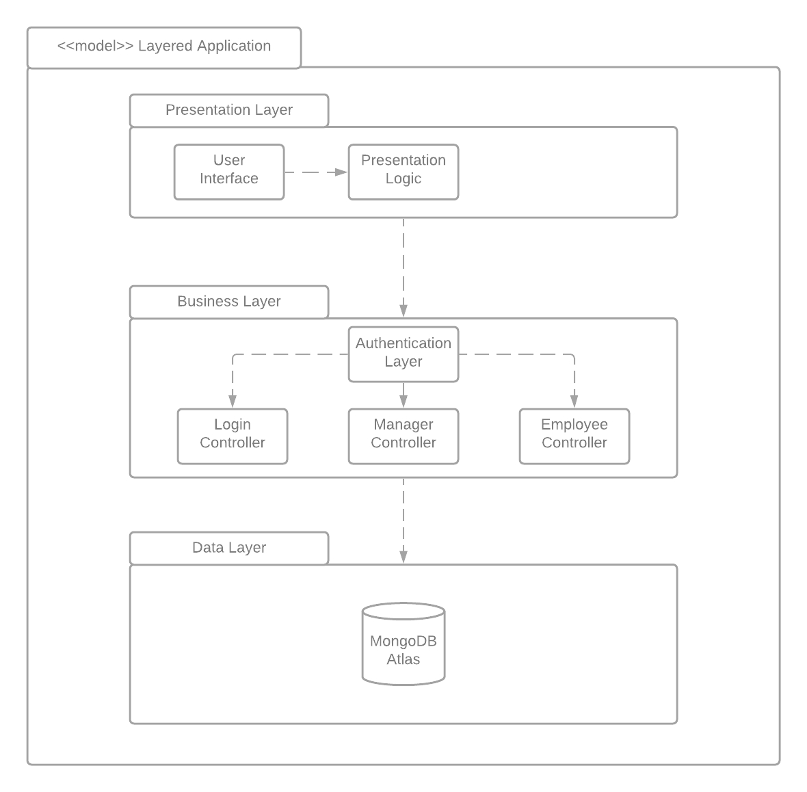
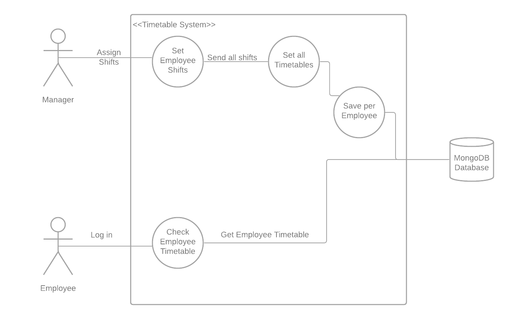

# ThinkShift Technical Manual

## A Technical Manual to the ThinkShift Web App.
### A CA326 Project

  
  

**Niall Dagg** - niall.dagg3@mail.dcu.ie
•
**Conor Kostick** - conor.mckeon22@mail.dcu.ie

  
  

# Table Of Contents 

1. [**Introduction** ](#introduction) 
&nbsp;&nbsp;&nbsp;&nbsp;&nbsp;&nbsp;1.1. [Overview](#overview) 
&nbsp;&nbsp;&nbsp;&nbsp;&nbsp;&nbsp;1.2. [Glossary](#glossary)  
2. [**System Architecture**](#architecture)  
3. [**High Level Design**](#high-level) 
&nbsp;&nbsp;&nbsp;&nbsp;&nbsp;&nbsp;3.1. [Database Schema Diagram](#schema) 
&nbsp;&nbsp;&nbsp;&nbsp;&nbsp;&nbsp;3.2. [Context Data Flow Diagram](#context) 
&nbsp;&nbsp;&nbsp;&nbsp;&nbsp;&nbsp;3.3. [Package Diagram](#package) 
&nbsp;&nbsp;&nbsp;&nbsp;&nbsp;&nbsp;3.4. [Use Case Diagram](#usecase) 
  
4. [**Problems and Resolutions**](#problems-resolutions)  
5. [**Installation Guide**](#install)  

 

 

# 1. Introduction  

## 1.1. Overview 

ThinkShift is a web-application that allows a manager of a small - medium size businesses to create employee entries and allows them to set the shifts of their employees through an easy to use timetable that is presented to them on the web page. This timetable is saved automatically every time a manager adds a new shift, meaning that the job of organising the weekly rota and informing the employees of the updated rota is done in one simple action. Employees are then also able to log in to see their own individual timetable. Through this system we hope that we have made this process more streamlined for both managers and employees alike.

The intention behind ThinkShift is to solve a problem faced by many small - medium sized businesses. A part of business life we wanted to help streamline is how managers create and set shifts for their employees. Many businesses find themselves using pen and paper methods, or having to text all of their employees individually to create their rotas. This can easily lead to miscommunication or misunderstandings between the managers and their employees. We feel we have succeeded in this task, creating a one stop system for both managers and their respective employees.

Our project has changed in some pretty significant ways as time passed, most notably in the technologies we used which we will explain further down. The manner in which features were implemented and realised changed also but we feel this was for the betterment of the system. 
  
  

## 1.2. Glossary

|  **Term**     |   Definition  |
| ------------- |:-------------:|
| **Javascript**    | 
JavaScript is a high-level programming language, often just-in-time compiled, and multi-paradigm. It has curly-bracket syntax, dynamic typing, prototype-based object-orientation, and first-class functions.
|
| **React**               | 
React is an open-source, front end, JavaScript library for building user interfaces or UI components.
|
| **MaterialUI**          | 
Material-UI is a simple and customizable component library to build faster, beautiful, and more accessible React applications.
|
| **REST**          | 
Representational State Transfer is an architectural style for providing standards between computer systems on the web. A client makes a request to the server in order to retrieve or modify data on the server.
|
| **Node.js**       | 
Node.js is an open-source, cross-platform, back-end JavaScript runtime environment that runs on the V8 engine and executes JavaScript code outside a web browser.
 |
| **Express**        | 
Express.js, or simply Express, is a back end web application framework for Node.js, released as free and open-source software. It is designed for building web applications and APIs. It has been called the de facto standard server framework for Node.js
|
| **API**            | 
Application Programming Interface is an interface between different parts of the programme intended to simplify the implementation of software.
|
| **Bcrypt**              | 
bcrypt is a password-hashing function. 
|
| **MongoDB**            | 
MongoDB is a source-available cross-platform document-oriented database program.

| **_id**               | 

# 2. System Architecture

  

In our web application, we used the popular web development stack, the MERN stack. within the MERN stack, the work is essentially split between a "frontend" and a "backend". Each letter in MERN stands for a different technology that we used. MongoDB was used for our database and data storage. Express.js was used as a for the Rest API. React.js for the front end/User Interface and Nodejs which was used to create and enable the interaction between our clearly defined frontend and backend. This means that the system architecture for our project can be broadly described in 4 different sections: the database, the backend, the frontend and the user.
  
  

• React.js:
React.js is a declaratively written and efficient javascript framework that we used to create a quick, simple and inviting user interface. It is based on the idea of components, in where you break your application down into small managable parts e.g a login form. We used this component based design to break out app down and distinguish between the user experience for both the manager and the employee. To speed up the process, 
  
  
 We used *MaterialUI* as an external framework to quickly create UI elements that look clean and professional. 
  
  
 We also used the *dev-express React scheduler component* to create a customised scheduling component that fit our needs within this web app. 
  
  
• Node / Express.js Authentication Layer - The authentication layer of this system is handled in the backend. Certain routes in the backend can only be accessed if the user is actually logged in. There are a certain amount of checks to make sure that a user is logged in correctly, this means that the user must know the email address and password of an account to be logged in. Once a user is logged in then the user is given a token which is stored as a cookie in the web browser. This token then authorises the user to certain routes within the backend
  
  
We used *JSON Web Tokens* as they are a good way to exchange information between parties within an application, in our case the frontend and the backend. We used them for login authentication and what information the account could see.
  
  
• Node / Express.js REST API - The REST API handles all of the actual functionality that the backend needs to provide for the frontend. All data entries from the user will be passed to the backend in some form or another and if the frontend is supposed to show the user information then the REST API will provide that information when called upon.
  
  
We used *Axios* to transmit data between the frontend and backend through the use of HTTP requests. Axios made it extremely easy to do so as it automatically transforms to json objects unlike fetch, a similar javascript library. 
  
  
•MongoDB
MongoDB Database - The MongoDB database stores all of the information we need to know about the users accounts. The database is called upon for nearly every action that is done by the user on the frontend. 
  
  
We made use of *MongoDB Atlas* which is a cloud based database, which is not only useful for collaboration but also useful for web-applications as well. MongoDB Atlas is automatically set up as a cluster, meaning that there is more than one server with a copy of the database in it. This is to make sure that if one server goes down, the database is still accessible through one of the other servers in the cluster.
  
  
We also used *Mongoose* which is an Object Data Modeling (ODM) library for MongoDB and Node. js. we used it to manage relationships between data, provides schema validation, and to translate between objects in code and the representation of those objects in MongoDB.
  
  

# 3. High Level Design

## 3.1 Schema Diagram
  
  

  
  
This is a small breakdown of the schemas we used in the creation of our database. This diagram represents the data we store and the structure that we store it in. It is what we found to be neccessary to store in order to run the system and it's different user accounts smoothly. Relationships between the schemas were established through the use of object ids such as the manager entry in the employee schema. 
  
  
However it is important to note that the timetable object is not an individual schema by itself but rather is defined within the Employee schema. The employee array in the Manager schema is an array of employee IDs as well.
  
  

## 3.2. Context Data Flow Diagram
  
  

  
  
This is a context data flow diagram which shows the flow of data from the user (manager or employee) all the way through the frontend, backend and database. If an employee were to log in, this is the data flow that they would initiate. If a manager were to log in or create an account (manager or employee) then this would also be the data flow that they would initiate.
  
  
Most functionality in this system will look very similar to this diagram as it is of course all based off the same web-dev stack
  
  

## 3.3. Package Diagram
  
  

  
  
The package diagram illustrates how the different sections of the system are related and interact with each other.
  
The presentation layer is what the user will see. It is composed of the user interface (i.e. the layout) of the web page, and also the presentation logic which determines what data to display.
  
The business layer, is where a lot of the logic of the website is decided. The authentication layer ensures that only people logged in correctly have access to certain backend functions. The different controllers then provide different functionality depending on what the frontend requests, which is dependent on which type of user is logged in.
  
The data layer is where our MongoDB database fits in this diagram. We are using MongoDB Atlas which is a cloud service. The database will save and find data requested by the business layer when requested.
  

## 3.4. Use Case Diagram
  
  

  
  
This use case diagram shows the context of how a manager would set an employees shifts and how an employee then can view their shifts. When a manager sets a shift, the web app will send the entire timetable to the backend. The backend will then save the shifts employee by employee into the database. When an employee logs in, they will only see their own shifts. The details of these shifts will be retrieved from the database.
  
  

# 4. Problems and Resolutions
  
  
**A Change in Technologies:**
  
After we had completed our functional specification, we began to research how to approach and implement our project. As we researched we realised we had been somewhat niave in our approach and had not fully thought through what technologies we would be using. As we researched we found the idea of the MERN stack which we felt perfectly fit our project and could be implemented easily into what we needed. It was also something we had little experience in so it was a great experience to learn how these technologies work and interact together to create a cohesive system.
  
  
**Authentication:**
  
As we progressed through our project, the issue of how we authenticate users began to become more prominent. We found solutions that we felt we were not confident in but then we found the concept of json web tokens and cookies. This allowed us to create a unique ID for every account which can be checked whenever the user wants to log in. The token is stored as a cookie in the browser to then be used for validation throughout the system. This also made it easier to find and respond with the relevent information to that user such as their employees and timetable.
  
  
**API Communication:**
  
As we used the MERN stack, our project was clearly defined into a frontend and backend. This allowed us to split a work down the middle into two distinct areas. This allowed us to research and work on things we were interested in and were relevent to us. This presented their own issues in where we worked on our ends in isolation. We needed constant communication to make sure our work remained relevant to each other. When it came to connecting the frontend and the backend there were some issues in how our code was constructed and how requests were being called. these issues were recitifed through clear communication and restructuring to allow our project to work seamlessly from front to back.
  
  

# 5. Installation Guide

### Foreword  
To run this application, you need access to a terminal and to have Node.js installed. 
  
  
### Software and Hardware Requirements
A PC with access to a terminal is required. You will need access to an internet connection and will need to install Node.js to run this application.
  
  
### Installation Instructions
1. Once you have installed Node.js, download the source code from this repo and extract the code onto your system. 
2. Open up two terminal windows, and move to the extracted folder in both windows.
3. Run the command "npm install" in one of the terminal windows to install dependencies for the frontend.
4. in the other window, move to the backend folder using "cd backend" and run the command "npm install" to install the dependancies for the backend. 
5. When the dependancies have been installed, run the command "npm start" in both terminal windows, this will start the scripts for both the frontend and backend. 
6. A browser window should open at "http://localhost:3000" with the react app running.
