

# ThinkShift User Manual

## A User Guide to the ThinkShift Web App.
### A CA326 Project

  
  

**Niall Dagg** - niall.dagg3@mail.dcu.ie
•
**Conor Kostick** - conor.mckeon22@mail.dcu.ie

  
  

# Table of Contents

 

1.[**Overview**](#overview)  
2.[**Type of Account**](#type)  
3.[**Manager Account**](#manager)  
3.[**Employee Account**](#employee)  

---

  

# Overview

ThinkShift is a web application with the purpose of making it easier and streamlining the process for managers to create shifts and assign timetables for employees. This app was created with small to medium sized businesses in mind. We decided upon this idea from both of our experiences in the retail/service industry and felt this was an area that could be improved. The app is essentially split into two different views, that of the manager and also that of the employee. In this user guide we will describe the functionality for both types of users. 

  
#### 1.1 Type of Account - Manager
1. Sign up
2. Log in
3. Create & Delete Employees
4. Create TimeTable
5. Log out

   
#### 1.2 Type of Account - Employee
1. Log in
2. View TimeTable
3. Log Out

---

# 1.1 Type of Account - Manager

#### 1. Sign up

You are first greeted with the login page, if you do not have an account, you can click the small link "Don't have an account? Sign Up!" located under the "Employee Login" button. This will then bring you to the Sign up page. 

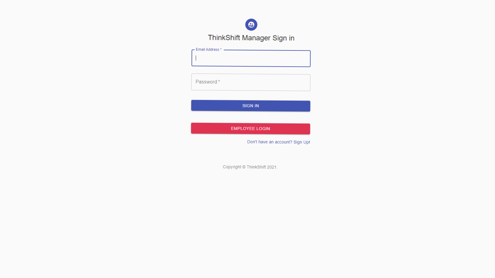
  
  
  
Once there, you can fill in the fields accordingly with your full name, email address and your chosen password. Keep this safe as you will need it to log in! Once you have filled in the text fields, click the Sign up button, and you'll be transported back to the login page.
  
  
  
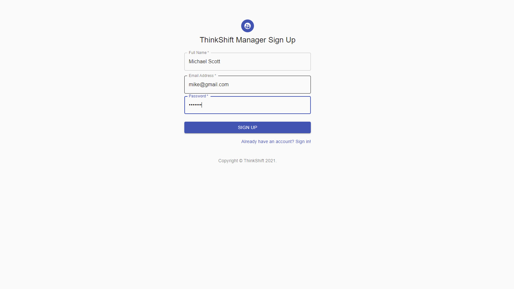

---
#### 2. Log in

Once you have completed the Signup process, You will now be back at the Manager Login page. you may now log in with the email address and password associated with your account. if your details are correct, you will be now logged in and moved to the main areas of the app.  
  
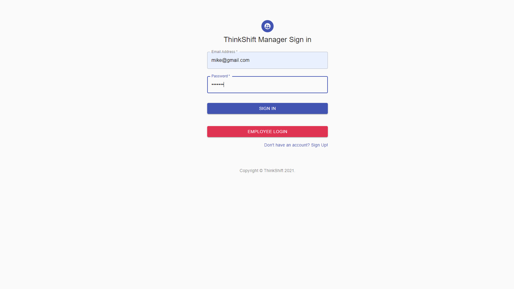
  
  
If your information is deemed to be incorrect, you will be notified and prompted to try again.
  
  
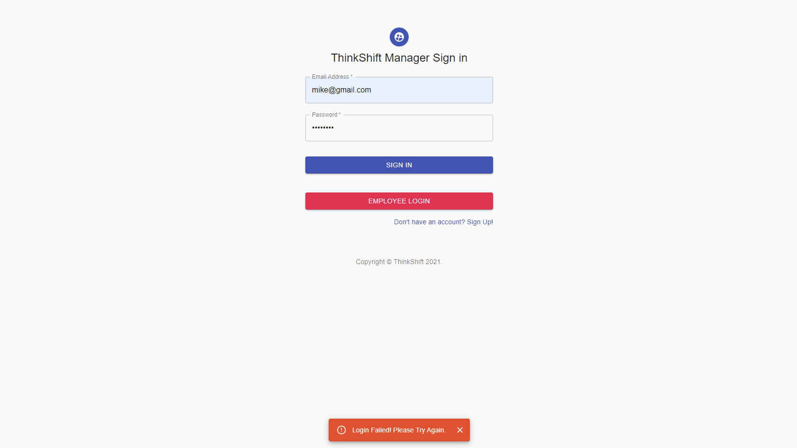

---
#### 3. Create Employees

When you succesfully login, you will be greeted with the employee page, which consists of two main components, the employee form and the employee table. The employee table will intially be empty. 
(Not shown in picture due to size contstraints -Navbar, which is explained further down)
  
  
  
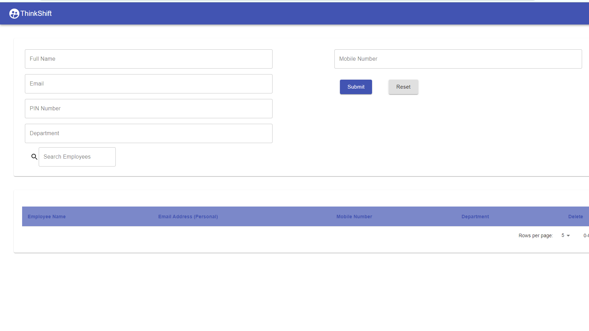
  
  
  
You can then fill in employee information, taking note of their email and PIN Number as your employees will need these to log in and should be kept confidental to the employees themselves.
  
  
  
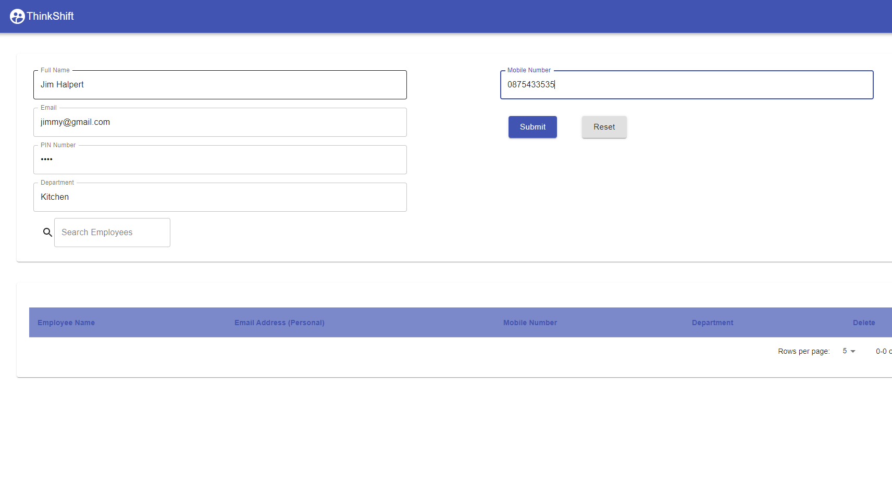
  
  
  
Once you create an employee they will be displayed in the table underneath the form.
  
  
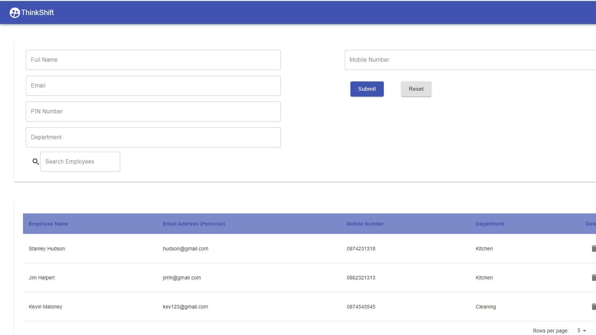
  
  
  
You also then have the function to delete employees if needed which will remove them from the table and the timetable using the easy to find bin button beside each employee's name. 
  
  
  
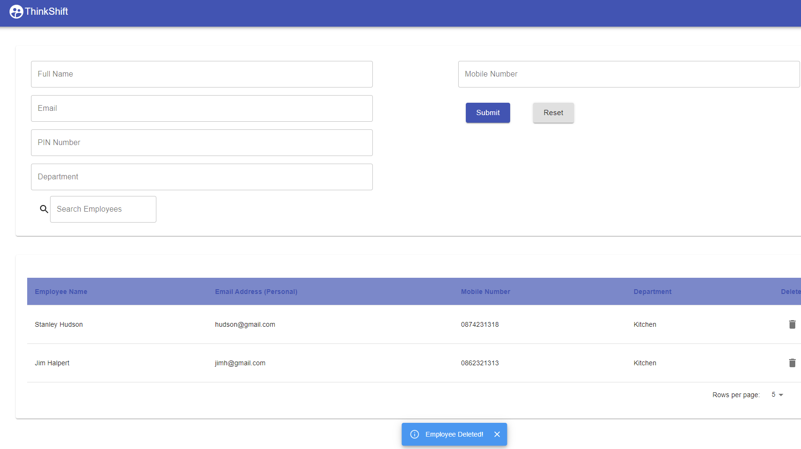
  
  
  
You also have various other functionality such as searching by name, and pages to save on screen space. You can specifiy how many table entries you would like also.
  
  
  
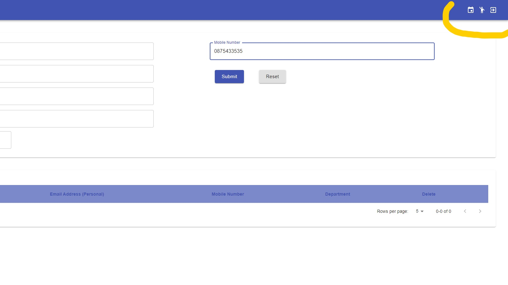
  
  
  
You can navigate to the timetable page by clicking on the calander icon in the navbar. The person icon is to go to the employee page (the one we are on right now) and the third icon is to log out, use this at any time to be returned to the login page.

---
#### 4. Create Timetable

After you have added your employees, you can now click on the calander icon in the navbar, this will navigate you to the timetable page. As no shifts have been created, the timetable will be empty to begin.
  
  
  
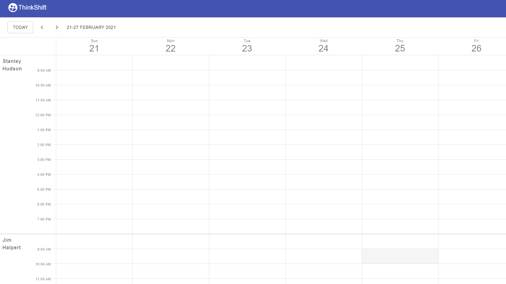
  
  
  
To begin Adding shifts, you can double click on a time and date you want to add a shift to. This will then bring up a menu to add a title and also the time and date. Then click save and the shift will appear in the employee's timetable. 
  
  
  
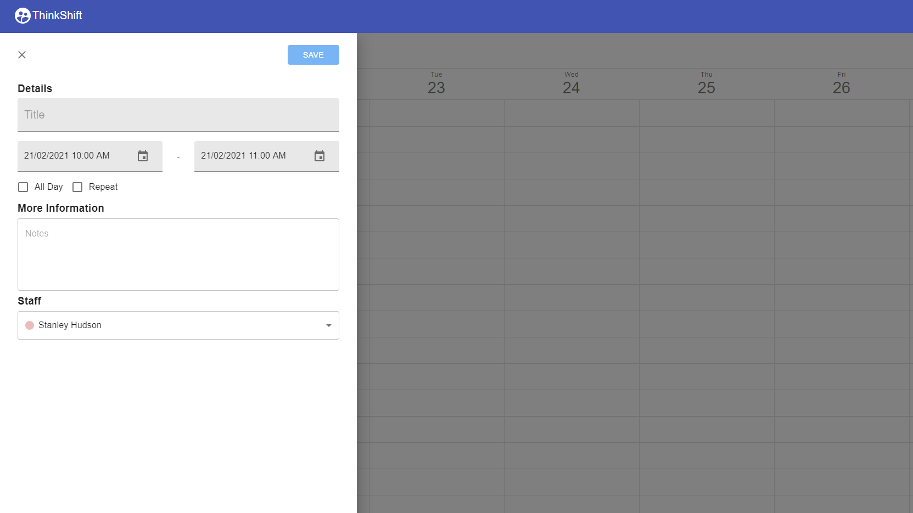
  
  
  
Our timetable aslo supports user friendly features such as drag and drop, vertical or horizontal orientations and also a calander to go further into the future at will.
  
  
  
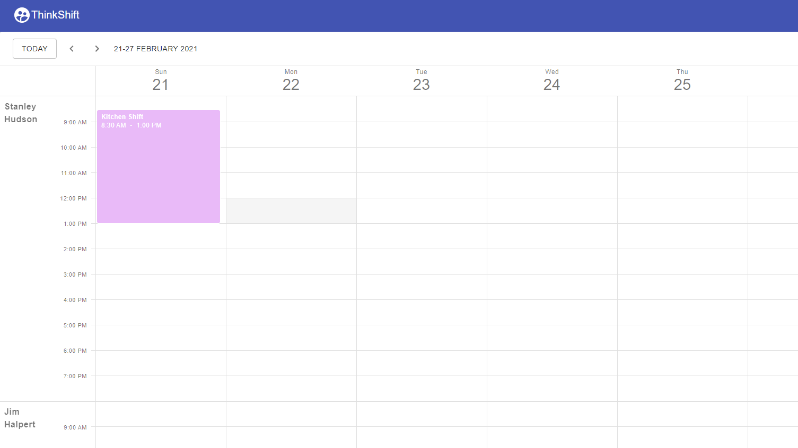
  
  
  
An Example of a somewhat filled timetable.
  
  
  
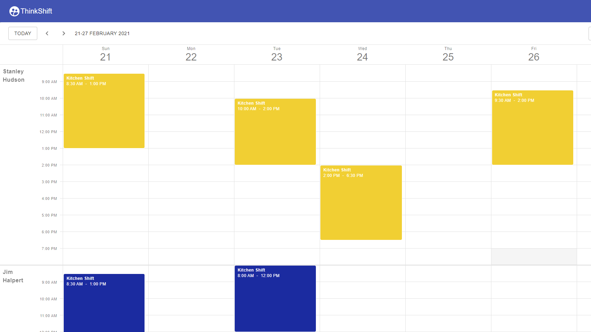
  
  
  

---
#### 5. Logout 

Once you are ready to log out, you can navigate there by going to the navbar at the top and clicking the exit icon. You will then be brought back to the login page. 
  
  
  

---

# 1.2 Type of Account - Employee

#### 1. Login
An employee account is much more straightforward to use. You can navigate to the employee login by clicking the red employee login button on the manager login page. Using the email and PIN number the manager has created for you, you can login and be transported to the timetable page.
  
  
  
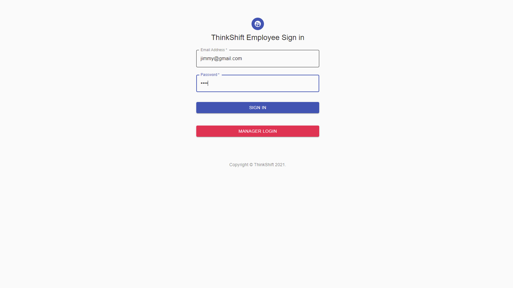

---
#### 2. View Timetable
Once you are logged in you will be presented with your employee specific timetable. this differs from a manager's timetable as it is view only, so the employee cannot create or edit shifts. They also do not have access to the employee page, and only have the logout button in the navbar. 
  
  
  
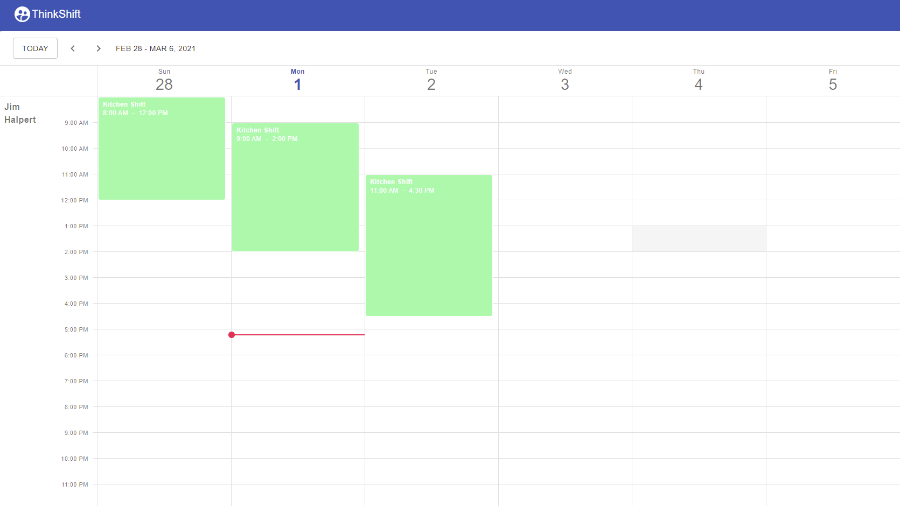
  
  
  

---
#### 3. Log out
  
  
  
Once you are ready to exit, you can navigate the navbar and click the exit icon to be transported back to the login page.
  
  
  
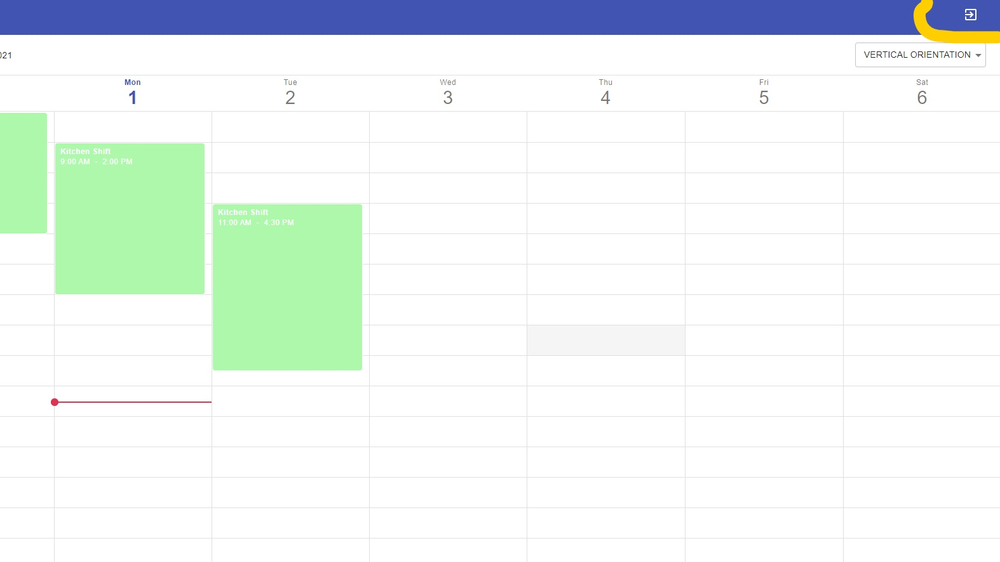

